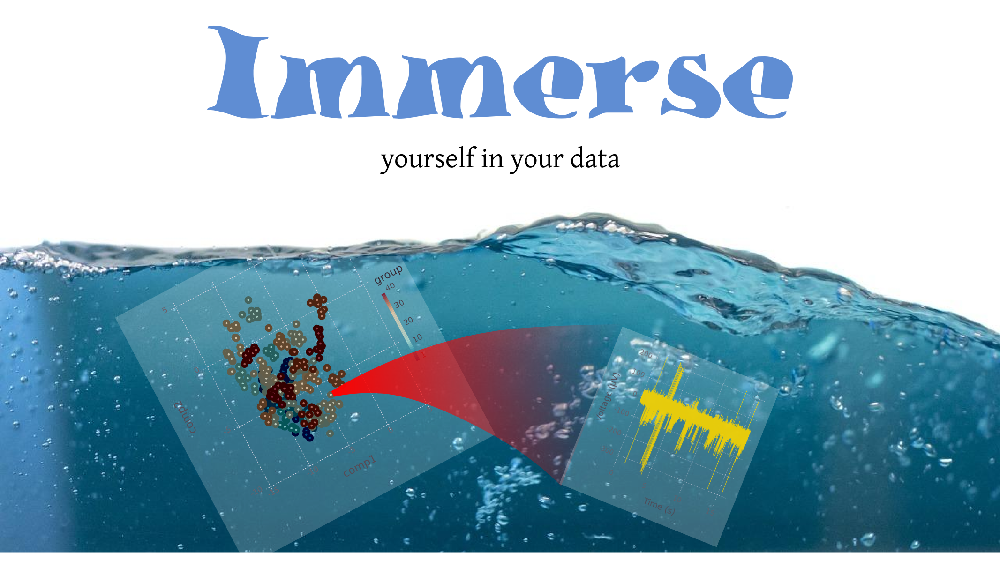
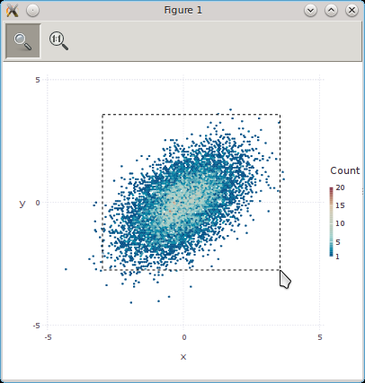
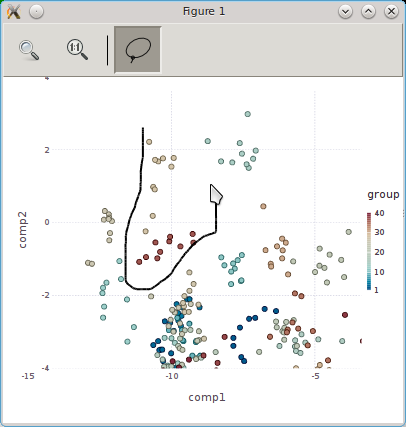
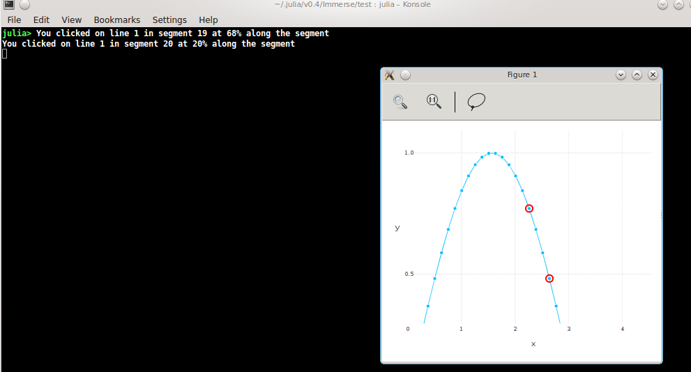

# Immerse

[](https://travis-ci.org/JuliaGraphics/Immerse.jl)

Immerse is a wrapper that adds graphical interactivity to Julia plots.
Currently, Immerse supports
[Gadfly](https://github.com/dcjones/Gadfly.jl).

# Usage

By and large, you plot just as you would in Gadfly:

```jl
using Immerse, Distributions
X = rand(MultivariateNormal([0.0, 0.0], [1.0 0.5; 0.5 1.0]), 10000)
plot(x=X[1,:], y=X[2,:], Geom.hexbin)
```
However, rather than being displayed in a browser window, you'll see your figure in a Gtk window:



The toolbar at the top supports saving your figure to a file, zooming and panning, and lasso selection.

Zooming and panning uses the defaults set by [GtkUtilities](https://github.com/timholy/GtkUtilities.jl).  The left mouse button allows you to rubberband-select a zoom region.  Use your mouse wheel or arrow-keys to pan or change the zoom level.  Double-click, or press the 1:1 button, to restore the full view.

## Lasso selection

The right-most button on the toolbar allows you to select a group of points for further analysis by drawing a "lasso" around them:



By default, this pops up a dialog asking you which variable in `Main` you want to save the selected indexes to:


You can alternatively define a custom callback function; see the help for `lasso_initialize` by typing `?lasso_initialize` at the REPL.

Lasso selection is currently implemented only for `Geom.point` and `Geom.line`.  If you want to try this feature, the demonstration in `test/faces.jl` can be fun.

## Hit testing

You can add extra interactivity by setting up callbacks that run whenever the user clicks on an object. A demonstration of this capability is exhibited in the `test/hittesting.jl` test script:



Here the red circles are drawn around the dots that the user clicked on; see also the console output that showed the results of clicking on the line segments between the dots.

Note that hit testing is disabled while the "zoom" button is active.  Like lasso selection, this is currently implemented only for `Geom.point` and `Geom.line`.

## Setting and getting properties

Objects can be modified interactively after their creation:

```jl
julia> using Immerse, Colors

julia> hfig = figure()
1

julia> x = linspace(0,4pi,101);

julia> p = plot(x=x, y=sin(x), Geom.line(tag=:line))

julia> setproperty!((hfig,:line), rand(1:5), :linewidth)
3

julia> setproperty!((hfig,:line), RGB(rand(),rand(),rand()), :stroke)
RGB{Float64}(0.9563599683564541,0.20964995278692222,0.997388106654052)

julia> setproperty!((hfig,:line), false, :visible)
false

julia> setproperty!((hfig,:line), true, :visible)
true

julia> getproperty((hfig,:line), :visible)
1-element Array{Bool,1}:
 true
```
Compose `Form` and `Property` objects apply to a vector of objects, which is why `getproperty` returns a vector.


## Figure windows

Each figure is addressed by an integer; for a window displaying a
single Gadfly figure, by default this integer appears in the window
title.

There are a few simple utilities for working with figure windows:

- `figure()` opens a new figure window. This will become the default
plotting window.
- `figure(3)` raises the corresponding window and makes it the default.
- `gcf()` returns the index of the current default figure.
- `scf()` shows the current figure (raising the window to the top).
- `closefig(3)` destroys Figure 3, closing the window.
- `closeall()` closes all open figure windows.


## Issues

#### When I type `scf()`, nothing happens

Your window manager may have "focus stealing prevention" enabled. For
example, under KDE, go to the Kmenu->System Settings->Window
behavior->Window behavior (pane)->Focus (tab) and set "Focus stealing
prevent" to "None".  Alternatively, if you want to limit this change
to julia, use the "Window rules" pane and add a new setting where
"Window class (application)" is set to "Regular Expression" with value
"^julia.*".
